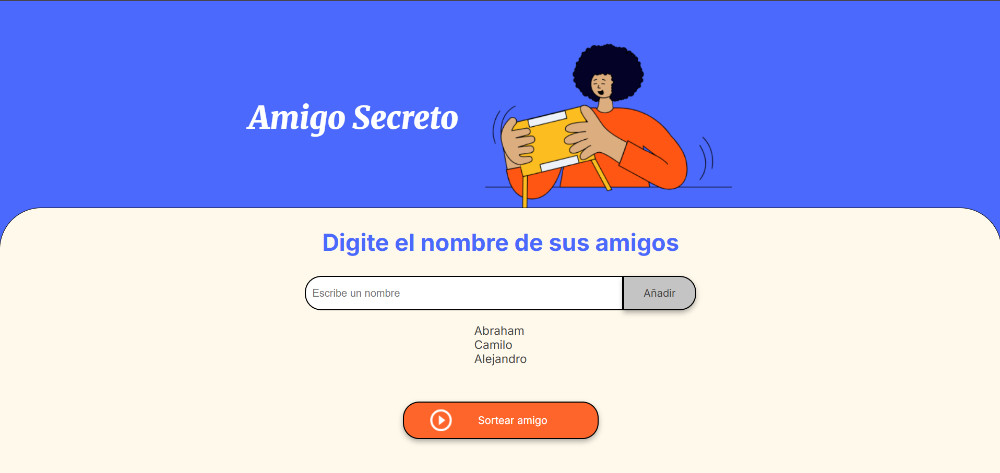

Ingresa el nombre de tu amigo en el campo "Escribe un nombre", luego has click en el botón "Añadir"

Los nombres añadidos aparecen abajo del campo "Escribe un nombre" de arriba hacia abajo.

En caso de que se haga click en "Añadir" y el campo este vacío aparecerá una alerta de "Por favor, inserte un nombre"

Cuando se haga click en "Sortear amigo" el programa seleccionará al azar un amigo de la lista y aparecerá una alerta diciendo el ganador del sorteo y tambien aparecerá el ganador en color verde.

Si haces click en el botón "Sortear amigo" sin haber agregado ningún amigos antes, aparecerá una alerta diciendote que "Por favor ingrese algún amigo".